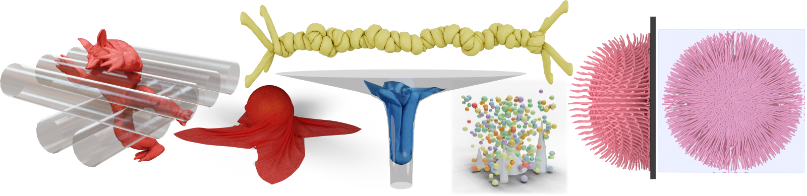

# (Sample) Scalable CCD Ground Truth Data



This repository contains sample ground truth data for "Time of Impact Dataset for Continuous Collision Detection and a Scalable Conservative Algorithm."

> :notebook: The full dataset will be released soon.

## Directory Structure

The highest-level directory contains a folder for each simulation scene used in the dataset.

```
armadillo-rollers
cloth-ball
cloth-funnel
n-body-simulation
puffer-ball
rod-twist
```

Each of these directories contains the following structure:

```
boxes
mma_bool
queries
roots
```

Each of these directories contains files for each time-step of the simulation.
The number indicates the time-step number and the letters `ee` and `vf` indicate if the data corresponds to edge-edge or vertex-face queries, respectively.

Additionally, each high-level directory contains a `frames` directory which contains the mesh for each frame of the simulation.

## Boxes

The `boxes` folders contain a series of JSON files. Each JSON contains an array of arrays of length two containing the IDs of the boxes that intersect.

For example, the file `armadillo-rollers/boxes/3ee.json` contains the following:
```json
[
    [
        14175,
        30842
    ],
    [
        14286,
        38673
    ]
]
```
which indicates that boxes `14175` and `30842` intersect as well as boxes `14286` and `38673`.

## Queries

The queries folders contains a series of `.csv` files. The files are structured as:
* `8*n` rows where `n` is the number of queries
* every 8 rows corresponds to a single query
* each row corresponds to a vertex's position
* the order of the rows is:
    * Edge-edge queries: `ea0_t0, ea1_t0, eb0_t0, eb1_t0, ea0_t1, ea1_t1, eb0_t1, eb1_t1` where `a` or `b` indicates which edge, `0` or `1` indicates the end point of the edge, and `t0` or `t1` indicates the starting or ending positions of the edge.
    * Vertex-face queries: `v_t0, f0_t0, f1_t0, f2_t0, v_t1, f0_t1, f1_t1, f2_t1` where `v` indicates the vertex, `f0`, `f1`, or `f2` indicates the face vertices, and `t0` or `t1` indicates the starting or ending positions of the vertex.
* `6` columns of integers
* each pair of columns (`1`/`2`, `3`/`4`, and `5`/`6`) comprise a single rational number for the `x`, `y`, and `z` coordinates of the vertex, respectively.

For example, the file `armadillo-rollers/queries/3ee.csv` contains the following:
```cs
6896999465383287, 36028797018963968, 5245561632958895, 4503599627370496, -5570196134319905, 18014398509481984
6896999465383287, 36028797018963968, 5245561632958895, 4503599627370496, -3713452079947597, 18014398509481984
6572878009405363, 36028797018963968, 5279205110643761, 4503599627370496, -8087556680271451, 36028797018963968
6178272675936085, 36028797018963968, 1318445697380205, 1125899906842624, -8625030737350413, 36028797018963968
3300739107499631, 18014398509481984, 5238954040637815, 4503599627370496, -5570196134319905, 18014398509481984
3300739107499631, 18014398509481984, 5238954040637815, 4503599627370496, -3713452079947597, 18014398509481984
415760439654143, 2251799813685248, 1310103326807689, 1125899906842624, -4055063906160507, 18014398509481984
6280837848758083, 36028797018963968, 1307430829898553, 1125899906842624, -8634198005750667, 36028797018963968
6896999465383287, 36028797018963968, 5245561632958895, 4503599627370496, 5570196134319905, 18014398509481984
6896999465383287, 36028797018963968, 5245561632958895, 4503599627370496, 3713452079947597, 18014398509481984
3038487479386979, 18014398509481984, 1317005720322519, 1125899906842624, 3855274513145955, 18014398509481984
6658627257252229, 36028797018963968, 2635686781414275, 2251799813685248, 8511631460371279, 36028797018963968
3300739107499631, 18014398509481984, 5238954040637815, 4503599627370496, 5570196134319905, 18014398509481984
3300739107499631, 18014398509481984, 5238954040637815, 4503599627370496, 3713452079947597, 18014398509481984
6168065397031465, 36028797018963968, 1308064160866209, 1125899906842624, 7623744805191723, 36028797018963968
6708225370540171, 36028797018963968, 2620301789222803, 2251799813685248, 2108135822468527, 9007199254740992
```
which is of size `16×6` ((2 queries * 8 rows per query) × (2 columns per coordinate * 3 coordinates)).

## Mathematica Generated Boolean Results

The `mma_bool` folders contain a series of JSON files. Each JSON containes an array of boolean values indicating if the corresponding query collides (true) or not (false).

For example, the file `armadillo-rollers/mma_bool/3ee_mma_bool.json` contains the following:
```json
[false, false]
```
which indicates neither of the queries in `armadillo-rollers/queries/3ee.csv` collide.

## Mathematica Generated Roots

The `roots` folder contains a series of `.tar.gz` files. Each `.tar.gz` file contains multiple `.wxf` Mathematica files. There is one `.wxf` file per colliding query (hence some of the `.tar.gz` files are empty because no collision occurs). These `.wxf` files contain the **valid** symbolic roots of the time of impact equation for the corresponding query. They can be opened in Mathematica using `roots = Import["path/to/file.wxf"];`.

For example, the file `armadillo-rollers/roots/3ee_roots.tar` is empty because no collision occurs in `armadillo-rollers/queries/3ee.csv`.

Another example is the file `armadillo-rollers/roots/7ee_roots.tar` which contains the following `.wxf` files:
```
7ee_q0_roots.wxf
7ee_q1_roots.wxf
7ee_q2_roots.wxf
7ee_q3_roots.wxf
7ee_q4_roots.wxf
```
which contain the roots for the first five queries in `armadillo-rollers/queries/7ee.csv`.

The contents of each `.wxf` file is a list of symbolic roots. For example, the file `7ee_q0_roots.wxf` contains the following:
```mathematica
{{
    t -> Root[4378223306655280691504420565761527705374864 - 9544535075583226097920264671275704925744443*#1 + 5201746432656463262747693410436504932105911*#1^2 + 13645803353680734592999942957915267612*#1^3 & , 2, 0],
    a -> -((2*(-918358125225068045527726254075989063042687867586702251186403\19315963878861324541 + 213874878654502740768291327458902106437697912389840811\51423163192529488380678810*Root[4378223306655280691504420565761527705374864 - 9544535075583226097920264671275704925744443*#1 + 5201746432656463262747693410436504932105911*#1^2 + 13645803353680734592999942957915267612*#1^3 & , 2, 0] + 807917639524710582837215204444565744683395171839179986482058320548772\8016*Root[4378223306655280691504420565761527705374864 - 9544535075583226097920264671275704925744443*#1 + 5201746432656463262747693410436504932105911*#1^2 + 13645803353680734592999942957915267612*#1^3 & , 2, 0]^2))/389445\876561050120493762187117210062674853384847249203283282222244781771573380029),
    b -> (351706302182049934712277069254337794732341971101540145226094193659\607163246292013 + 36827826831164058938729936398366393245121381073525007087002\956462014497642309974*Root[4378223306655280691504420565761527705374864 - 9544535075583226097920264671275704925744443*#1 + 5201746432656463262747693410436504932105911*#1^2 + 13645803353680734592999942957915267612*#1^3 & , 2, 0] + 96611076027242257117557999318402381112665700513189145780115118785890351\032*Root[4378223306655280691504420565761527705374864 - 9544535075583226097920264671275704925744443*#1 + 5201746432656463262747693410436504932105911*#1^2 + 13645803353680734592999942957915267612*#1^3 & , 2, 0]^2)/389445876\561050120493762187117210062674853384847249203283282222244781771573380029
},{
    t -> Root[4378223306655280691504420565761527705374864 - 9544535075583226097920264671275704925744443*#1 + 5201746432656463262747693410436504932105911*#1^2 + 13645803353680734592999942957915267612*#1^3 & , 3, 0],
    a -> -((2*(-918358125225068045527726254075989063042687867586702251186403\19315963878861324541 + 213874878654502740768291327458902106437697912389840811\51423163192529488380678810*Root[4378223306655280691504420565761527705374864 - 9544535075583226097920264671275704925744443*#1 + 5201746432656463262747693410436504932105911*#1^2 + 13645803353680734592999942957915267612*#1^3 & , 3, 0] + 807917639524710582837215204444565744683395171839179986482058320548772\8016*Root[4378223306655280691504420565761527705374864 - 9544535075583226097920264671275704925744443*#1 + 5201746432656463262747693410436504932105911*#1^2 + 13645803353680734592999942957915267612*#1^3 & , 3, 0]^2))/389445\876561050120493762187117210062674853384847249203283282222244781771573380029),
    b -> (351706302182049934712277069254337794732341971101540145226094193659\607163246292013 + 36827826831164058938729936398366393245121381073525007087002\956462014497642309974*Root[4378223306655280691504420565761527705374864 - 9544535075583226097920264671275704925744443*#1 + 5201746432656463262747693410436504932105911*#1^2 + 13645803353680734592999942957915267612*#1^3 & , 3, 0] + 96611076027242257117557999318402381112665700513189145780115118785890351\032*Root[4378223306655280691504420565761527705374864 - 9544535075583226097920264671275704925744443*#1 + 5201746432656463262747693410436504932105911*#1^2 + 13645803353680734592999942957915267612*#1^3 & , 3, 0]^2)/389445876\561050120493762187117210062674853384847249203283282222244781771573380029
}}
```
where `t` is the time of impact and `a` and `b` are the parametric coordinates of the point of contact.

You can print the time(s) of impact using the following Mathematica function
```mathematica
PrintToI[rootsFilename_] := Module[{t},
    roots = Import[rootsFilename];
    For[i = 1, i <= Length[roots], i++,
        t = "t"/.roots[[i]];
        Print[t];
    ];
    Return[];
];
```

More Mathematica scripts for processing this data can be found [here](https://github.com/Continuous-Collision-Detection/Symbolic).

## Frames

The `frames` directory contains a series of `.obj` or `.ply` mesh files. Each file contains the mesh for a single frame of the simulation.
